# Architecture Overview

This document describes the system architecture, component structure, data flow patterns, and deployment topology.

## Table of Contents

- [High-Level Architecture](#high-level-architecture)
- [Component Hierarchy](#component-hierarchy)
- [Data Flow](#data-flow)
- [Router & Lazy Loading](#router--lazy-loading)
- [Build & Runtime Topology](#build--runtime-topology)
- [Module Boundaries](#module-boundaries)

## High-Level Architecture

The application follows a layered architecture with clear separation of concerns:

```
┌─────────────────────────────────────────────────┐
│            Presentation Layer                    │
│  (React components, routing, UI interactions)   │
├─────────────────────────────────────────────────┤
│         Application/Business Logic               │
│    (Custom hooks, context providers, utils)     │
├─────────────────────────────────────────────────┤
│            Data Access Layer                     │
│   (React Query, Axios client, MSW handlers)     │
├─────────────────────────────────────────────────┤
│         Infrastructure/Platform                  │
│  (Vite, nginx, Docker, AWS Amplify, Sentry)     │
└─────────────────────────────────────────────────┘
```

### Design Principles

1. **Component Composition**: Small, focused components over large monoliths
2. **Declarative Data Fetching**: React Query hooks at component level
3. **Type Safety**: Strict TypeScript, no `any` types, shared interfaces
4. **Progressive Enhancement**: Works without JS (static shell), enhanced with PWA
5. **Performance First**: Code splitting, lazy loading, optimized bundles

## Component Hierarchy

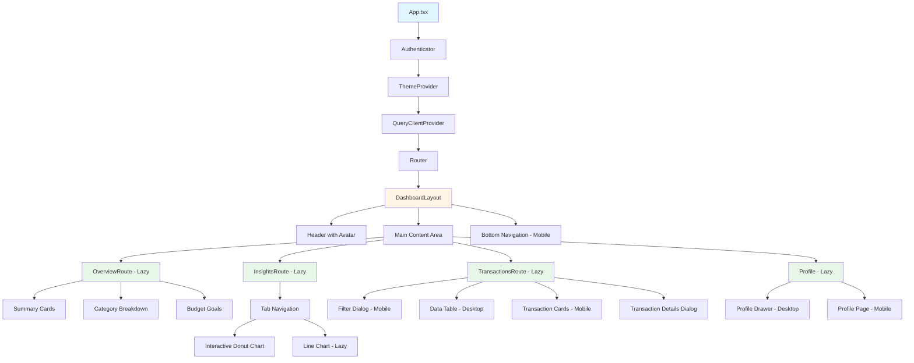

## Data Flow

### Server State Flow (React Query)

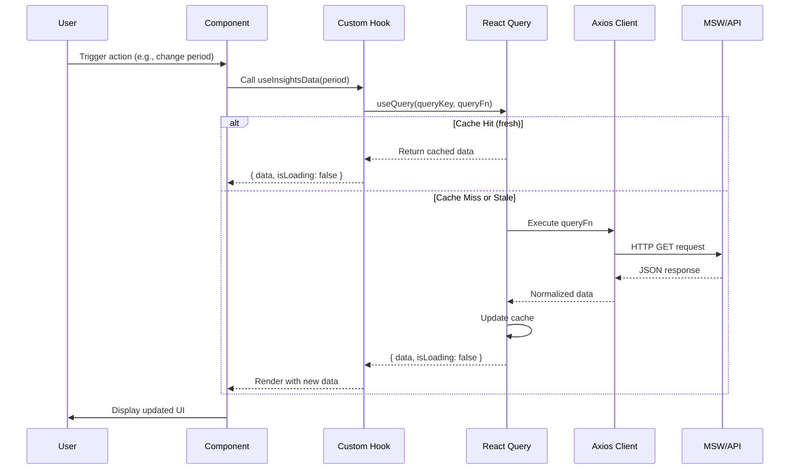

### Client State Flow (React Context)

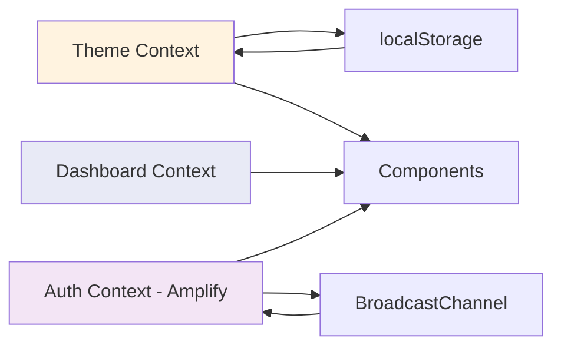

**State Ownership Rules**:

- **Server state**: React Query (cache, refetch, mutations)
- **UI state**: Component state (`useState`)
- **Shared UI state**: Context (theme, modal visibility)
- **Form state**: Local state with controlled inputs
- **URL state**: React Router (filters, active tab)

## Router & Lazy Loading

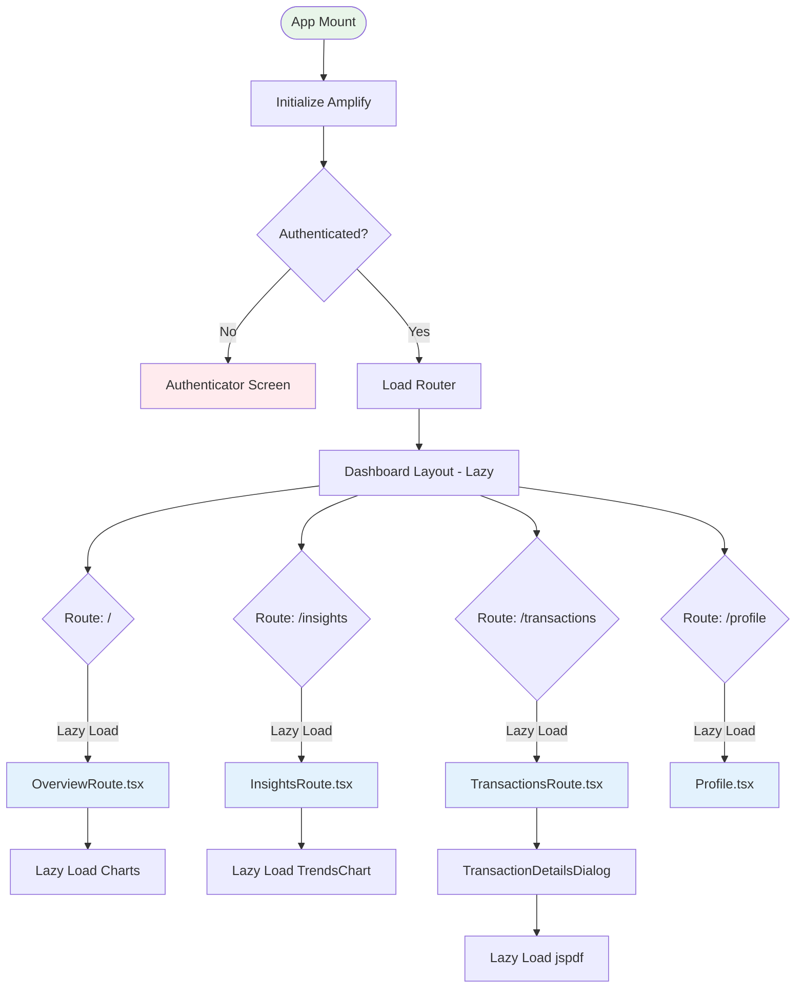

### Route Configuration

Routes are defined in `src/app/config/dashboard.config.ts`:

```typescript
{
  path: '/',
  component: () => import('../routes/OverviewRoute'),
  canActivate: () => isAuthenticated(), // Optional guard
  fallback: <LoadingSpinner /> // Optional loading state
}
```

**Lazy Loading Strategy**:

1. **Route-level**: All page components lazy-loaded via `React.lazy()`
2. **Chart-level**: Heavy libraries (Recharts) lazy-loaded on demand
3. **Feature-level**: Transaction details dialog + jspdf only when opened

## Build & Runtime Topology

### Development Flow

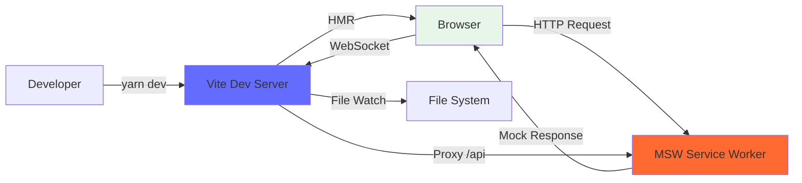

### Production Flow

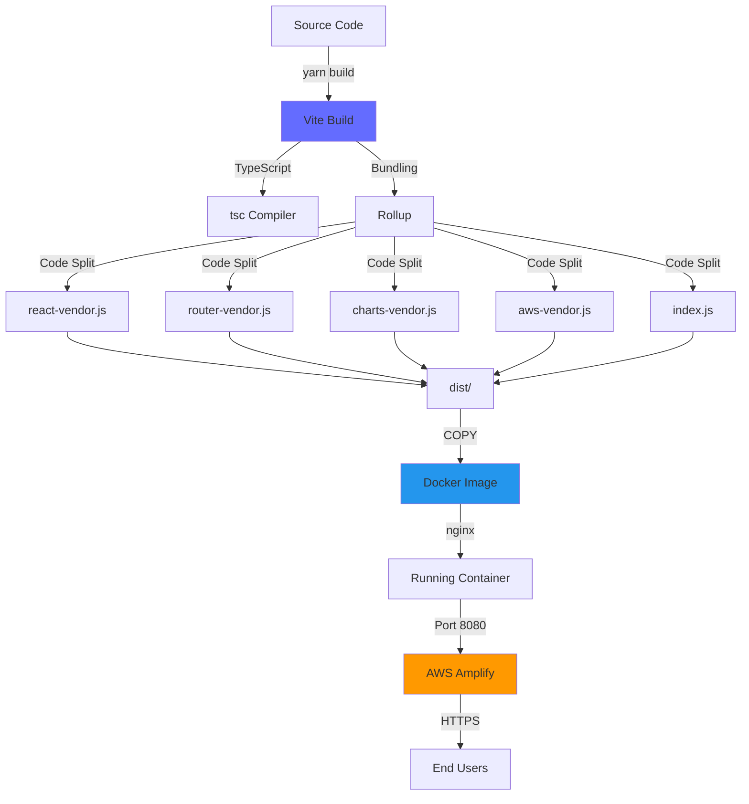

### Deployment Pipeline

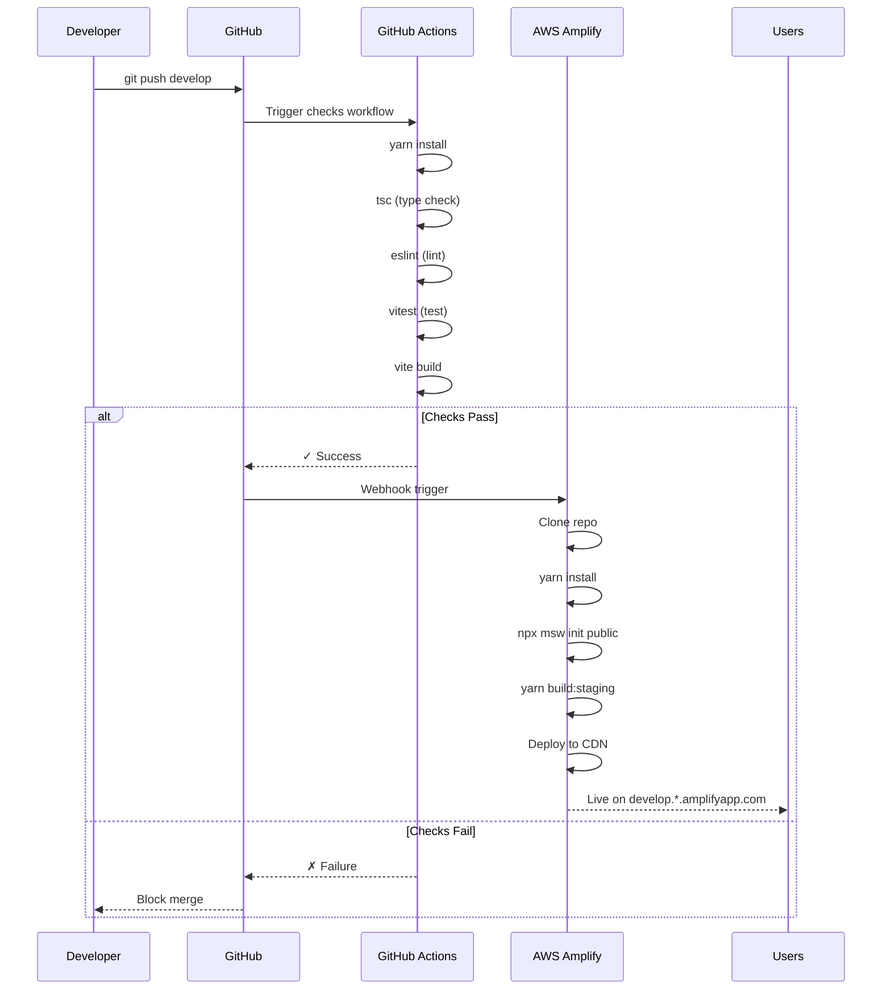

## Module Boundaries

### Directory Structure

```
src/
├── app/                  # Application setup & routing
│   ├── config/           # Route configuration
│   ├── routes/           # Page-level route components
│   └── router.tsx        # Router factory
│
├── components/           # Shared presentational components
│
├── contexts/             # React Context providers
│   ├── auth/             # Authentication context (Amplify)
│   ├── dashboard/        # Dashboard-specific state
│   └── theme/            # Theme context (light/dark)
│
├── data/                 # Data layer
│   ├── client.ts         # Axios instance + API functions
│   └── models.ts         # TypeScript interfaces
│
├── design-system/        # Design system components & tokens
│   ├── components/       # Reusable UI components
│   ├── hooks/            # Design system hooks
│   └── tokens.ts         # Design tokens (colors, spacing)
│
├── features/             # Feature modules (domain-driven)
│   ├── insights/         # Insights page feature
│   ├── overview/         # Overview dashboard feature
│   ├── profile/          # Profile management
│   └── transactions/     # Transactions feature
│
├── hooks/                # Shared custom hooks
│
├── i18n/                 # Internationalization
│   ├── config.ts         # i18next setup
│   └── locales/          # Translation files
│
├── layouts/              # Layout components
│   └── dashboard/        # Dashboard layout (header, nav)
│
├── lib/                  # Utility libraries
│   ├── categoryUtils.tsx # Category icon mapping
│   ├── chartConfig.ts    # Chart configuration
│   └── contrast.ts       # Color contrast calculations
│
├── mocks/                # MSW mock data layer
│   ├── browser.ts        # Browser MSW setup
│   ├── factories.ts      # Mock data factories
│   ├── handlers.ts       # API endpoint handlers
│   └── server.ts         # Node MSW setup (tests)
│
├── pages/                # Standalone pages (not in dashboard)
│   ├── NotFound.tsx      # 404 page
│   └── Profile.tsx       # Mobile profile page
│
├── styles/               # Global styles
│   ├── base.css          # Reset + global styles
│   └── tokens.css        # CSS custom properties
│
├── test/                 # Test utilities
│   ├── setup.ts          # Vitest setup
│   └── utils.tsx         # Test helpers (renderWithProviders)
│
└── utils/                # Utility functions
    ├── accessibility.ts  # a11y helpers
    ├── currency.ts       # ZAR formatting
    ├── dates.ts          # Date formatting
    ├── logger.ts         # Console logging
    ├── performance.ts    # Web Vitals
    ├── pwa.ts            # Service worker registration
    ├── sentry.ts         # Error tracking
    └── webVitals.ts      # Performance monitoring
```

### Import Rules

1. **No circular dependencies**: Enforced by ESLint
2. **Feature isolation**: Features only import from `src/design-system`, `src/data`, `src/utils`
3. **Design system purity**: No imports from features or pages
4. **Data layer independence**: `src/data` has no UI dependencies

### Dependency Graph

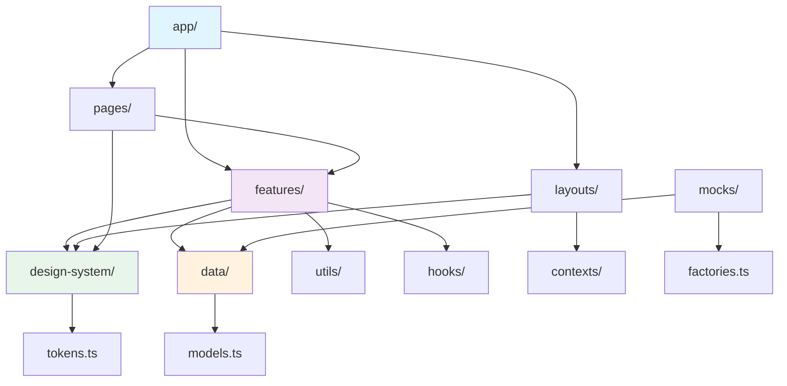

## Request/Response Flow

### Successful Request

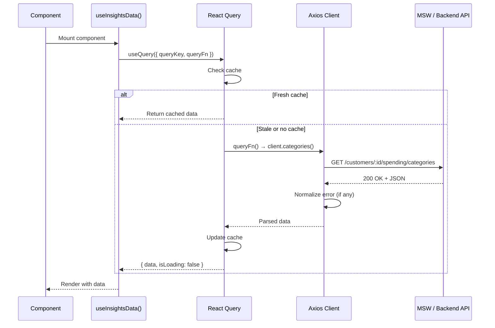

### Error Handling Flow

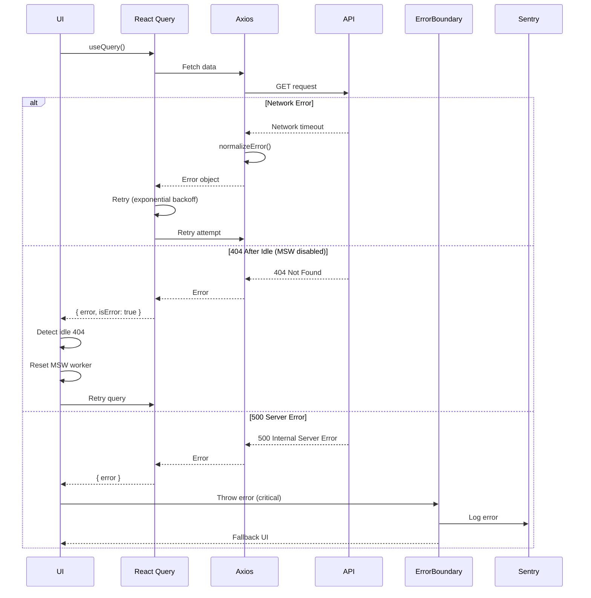

## State Synchronization

### Cross-Tab Logout

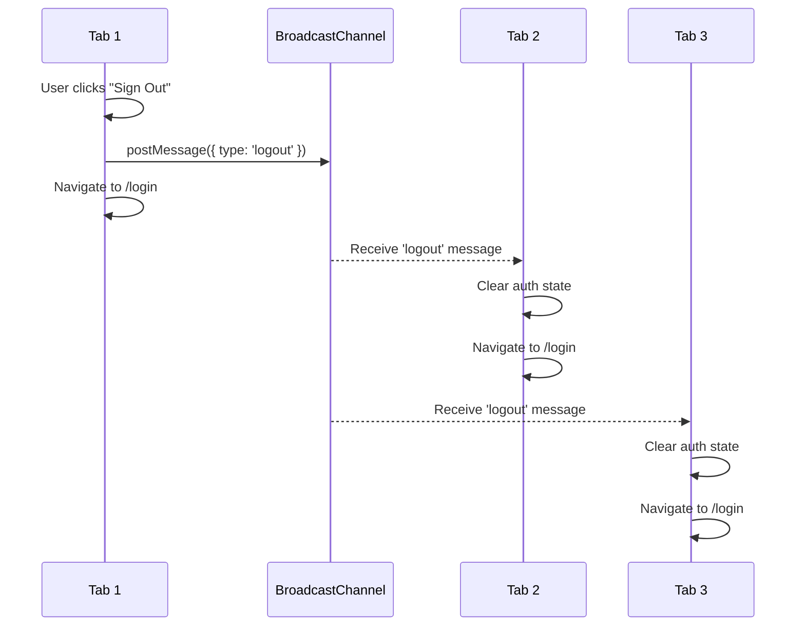

## Performance Considerations

### Code Splitting Strategy

- **Route-level**: All page components lazy-loaded (reduces initial bundle)
- **Library-level**: Heavy deps (Recharts, jspdf) loaded on demand
- **Vendor chunking**: React, Router, AWS Amplify in separate chunks (better caching)

### Cache Strategy

- **React Query**: Stale-while-revalidate (5min stale time, show stale while fetching)
- **Browser**: ServiceWorker caches static assets (HTML, JS, CSS, images)
- **nginx**: Far-future expires headers for static assets (1 year)

### Bundle Analysis

Run `yarn build` and check `dist/stats.html` (generated by `rollup-plugin-visualizer`):

- **Target**: Total JS < 500KB gzipped
- **Current**: ~380KB gzipped (main bundle + vendors)

## Last Updated

December 2024
